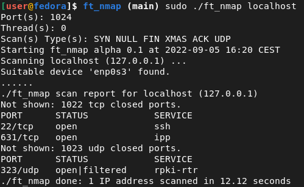

# ft_nmap
Reproduction of nmap command



## Compilation
You must install `libpcap-dev` or `libpcap-devel` package.
```
make
```

## Usage

```
Usage:
  ./ft_nmap [--option [arg]] --file FILE
  ./ft_nmap [--option [arg]] --ip IP/RANGE

Options:
-h	--help              	This option print this message
	--ip         [value]	This option take an address IP to scan.
	                    	Ex: --ip 127.0.0.1

	--file       [value]	Take a file containing list of IP to scan.
	                    	Ex: --file ./iplist

-p	--ports      [value]	Take a port to scan or a range. Ranges can't exceed 1024 ports.
	                    	Ex: --ports 53 or --ports 1-1024

-s	--scan       [value]	Select your scanning method.
	                    	Ex: --scan ACK

-t	--speedup    [value]	Number of threads to run on, up to 250.
	                    	Ex: --speedup 125

-v	--verbose           	Add verbosity to the output, forcing nmap to print every port result
```
